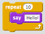

### Hello World

This is the traditional first program people run in a new language.

From your PythonAnywhere Dashboard, start a Python 3.4 console.


print("Hello, World")


Type this in, then press enter.

print() is a **function**. It does something using "Hello, World".

### Variables

Variables are like labels, letting you refer to something by a different name.


myname = "Allan"
print("Hello, " + myname)


Variables can be operated on, just like you'd expect.


x = 2
y = 4
z = x + y


In the console, just type a variable to see what it contains.

### Input

Use the input() function to read in what a user types and store it under a variable.


name = input("What's your name? ")
print("Hello, " + name)


### Lists and Loops

If you are familiar with Scratch or the Code.org tutorials, you will know about loops.
They let you repeat whatever is inside the loop.



This Scratch block would repeat 10 times. Each time, it will say "Hello". Python can do this, but more often you will loop over each item in a *list*.

In our example below, instead of saying "loop over the three veggies", we say "for each of the veggies in the salad, print the veggie's name."

This makes our program more flexible and easy to change.

 - Note the *spaces* after the "for" line! They are essential. All -indented- lines after the get included in the loop.


>>> salad = ["tomato", "cucumber", "lettuce"]
>>> print(salad)
["tomato", "cucumber", "lettuce"]
>>> for veggie in salad:
...     print(veggie)
... 
tomato
cucumber
lettuce
>>> 


Let's look at this piece by piece.

```python
>>> salad = ["tomato", "cucumber", "lettuce"]
```

First, create a list of vegetables. Call that list "salad". (Print it out to verify.)

```python
>>> for veggie in salad:
```

Start a loop. The loop will run once for each entry in the list "salad". (So, three times.) 
Refer to the current entry in the list by the name "veggie".

So, the first time through, when you say "veggie" it will use the string "tomato". The second, "cucumber".

```python
...     print(veggie)
...
```

Okay, what is happening here? Instead of the >>> symbols, we see ... three periods. 
And there are spaces before the print() function. What does this mean?

Remember, Python is designed to be easy to read. The *indentation* matters.

Just like the Scratch "repeat" block repeats everything inside it, a Python loop will repeat everything which has been indented.

To indent before the "print" statement, type four spaces.
Hit enter a second time to end your loop in the console.

Try it now and see.

